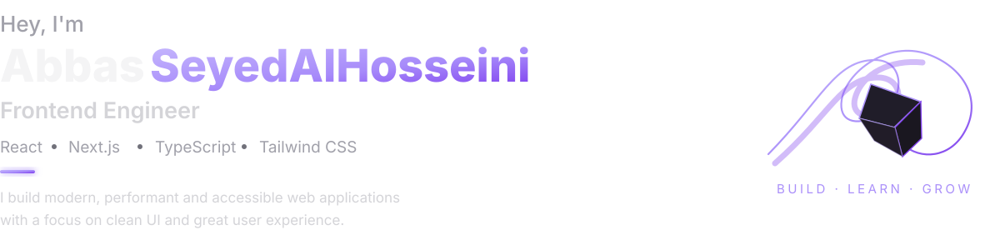

## 👤 About Me

I'm a frontend engineer who enjoys turning complex problems into simple, clean interfaces. I care as much about how a product feels to use as how the code behind it reads.

- 🚀 &nbsp;Currently building personal projects
- 🌱 &nbsp;Currently leveling up my Next.js skills professionally
- 💬 &nbsp;Happy to talk about React, JavaScript, and Tailwind CSS
- 📫 &nbsp;Reach me through the links below

## 💻 Tech Stack

**Core**
 

**Tools**
 

## 🔗 Connect With Me

## 📊 GitHub Stats

📈 Contribution Graph

  
 

BUILD · LEARN · GROW

Designed & built by Abbas SeyedAlHosseini

